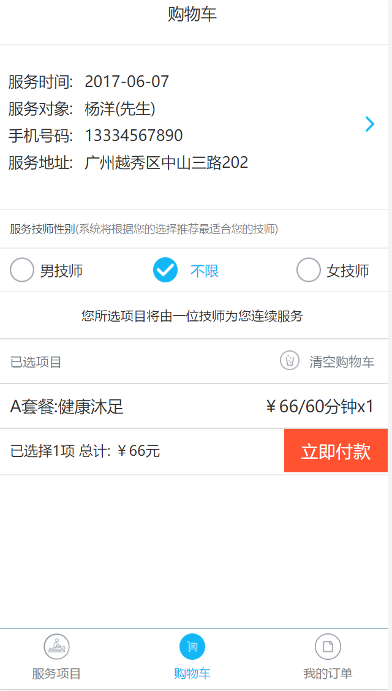
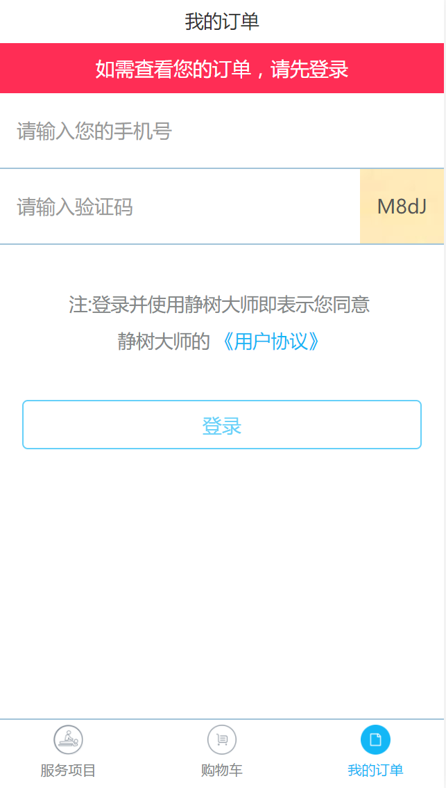
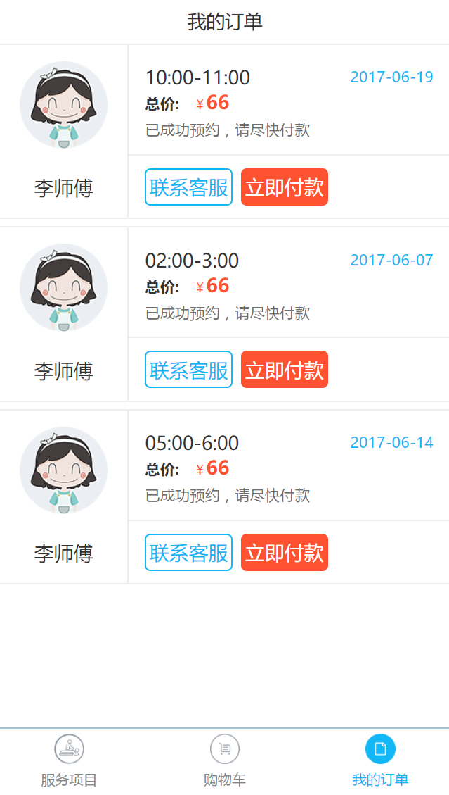

## jsds-mobile 静树大师上门理疗服务手机端下单项目
        项目基本目录结构如下：
                ├── node_modules // 打包过程中依赖的包
                ├── package.json // 包含各种所需模块以及项目的配置信息
                ├── gulpfile.js // 打包配置文件
                ├── app // 打包之后最终部署到服务器上的文件（名称自定义）
                ├── src  // 资源文件（名称自定义）
                        ├── components // 自定义全局组件
                        ├── pages // 页面路由组件
                                ├── product
                                        ├── product.html 获取项目页面
                                        ├── product.js    执行获取项目方法
                                        └── product.less  项目样式
                                ├── cart
                                ···
                                ├── assets // 静态资源
                                ├── img // 图片资源
                                ├── less // 样式表
                        ├── vendors // 第三方插件库
                        ├── app.router.js // 全局路由配置
                        ├── app.config.js // 配置信息
                        ├── app.service.js // 公共函数
                        ├── index.html // 入口视图模板
                        └── index.less // 入口视图样式
                        ├── server  // 后端文件
                        ├── models  // 创建mongoose模型
                ├── app.js  // 后端入口文件
                └── vendor.config.js // 依赖的库配置文件（自定义）
        项目功能：主要分三块，服务项目，购物车，我的订单
        1.服务项目是用户可以通过后台已经配置好的项目来进行选择加入购物车
        2.在购物车中可以查看自己的项目，并且填写下单信息
        3.在我的订单可以登录查看自己的订单
        项目截图：
                1.选取服务项目
                 
                2.查看购物车
                
                3.用户登录
                
                4.查看订单
                
        
